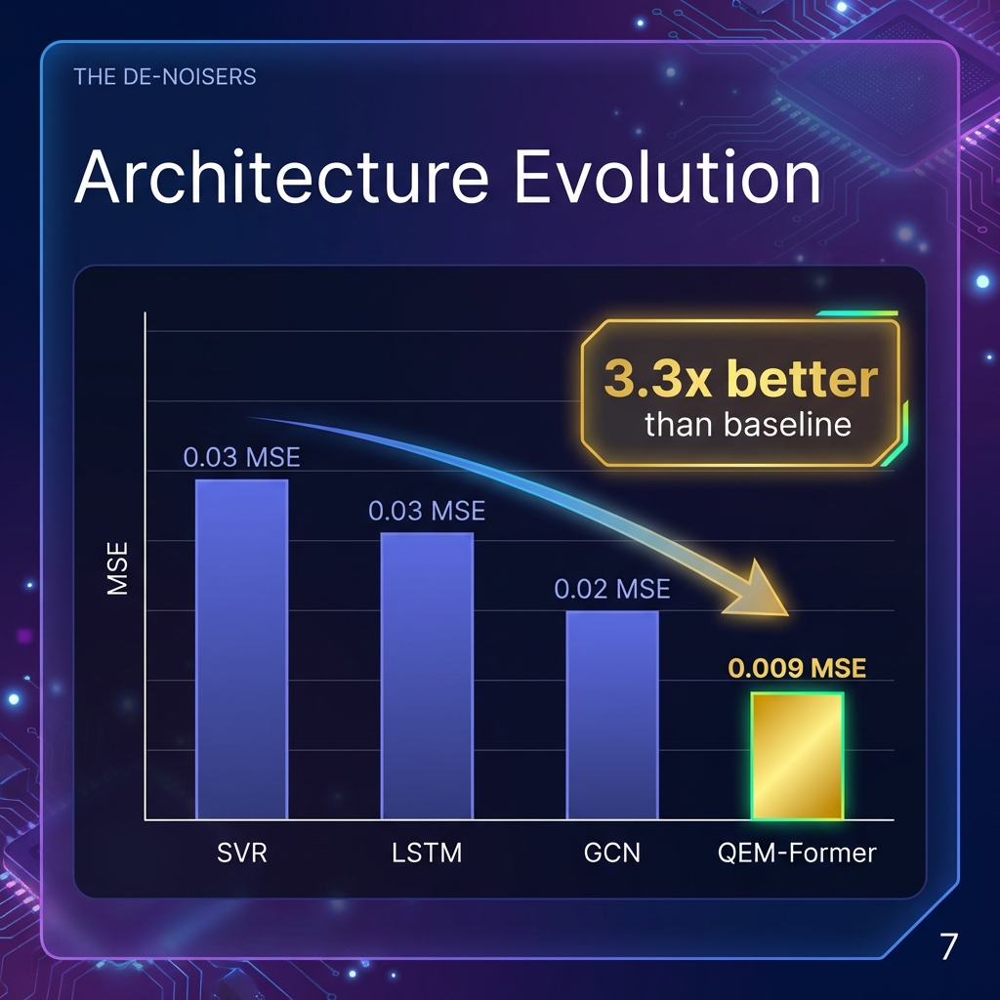
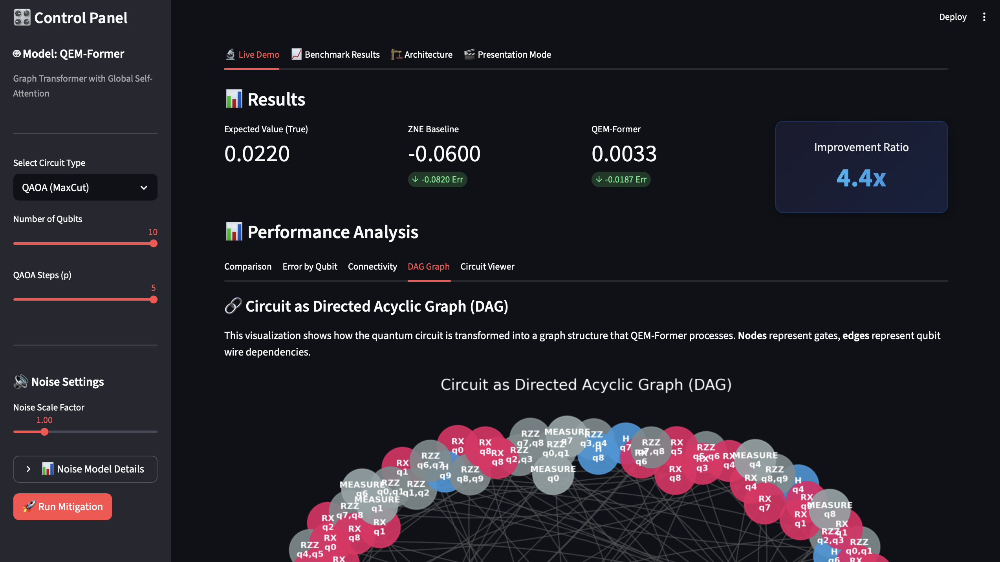
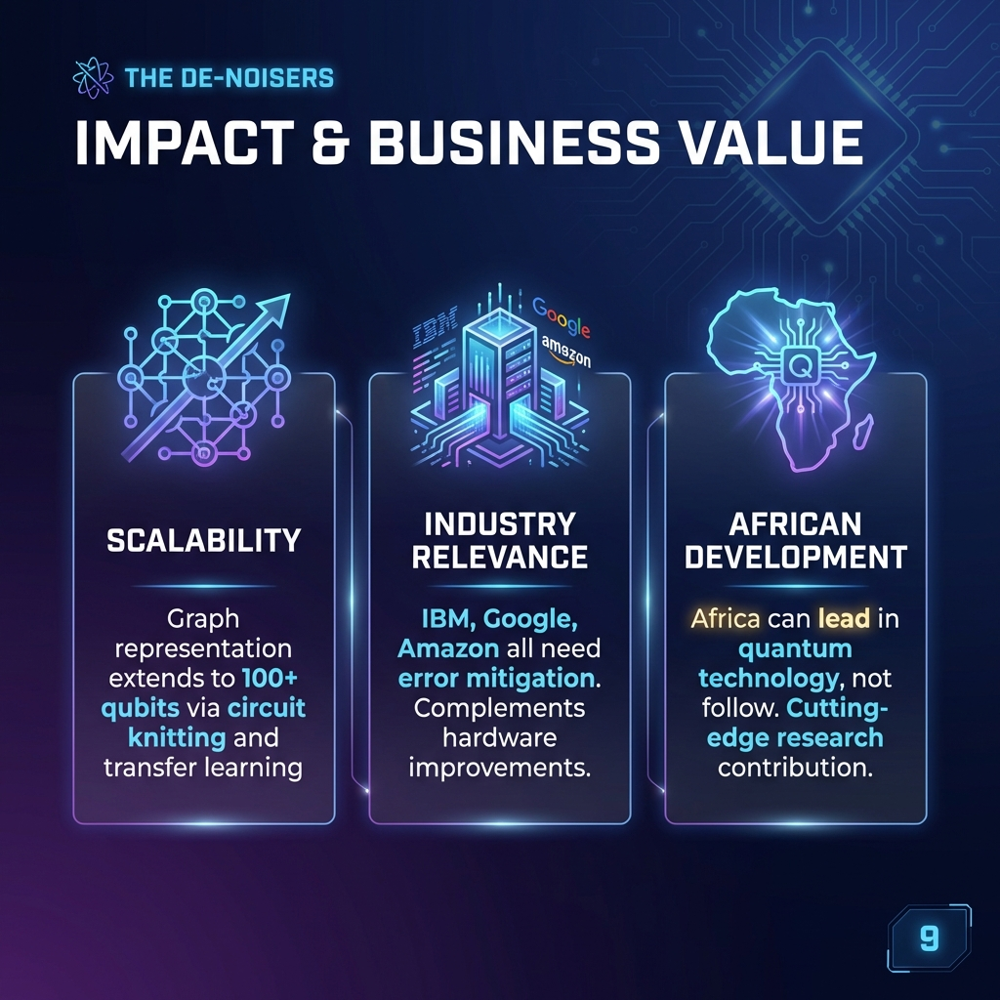
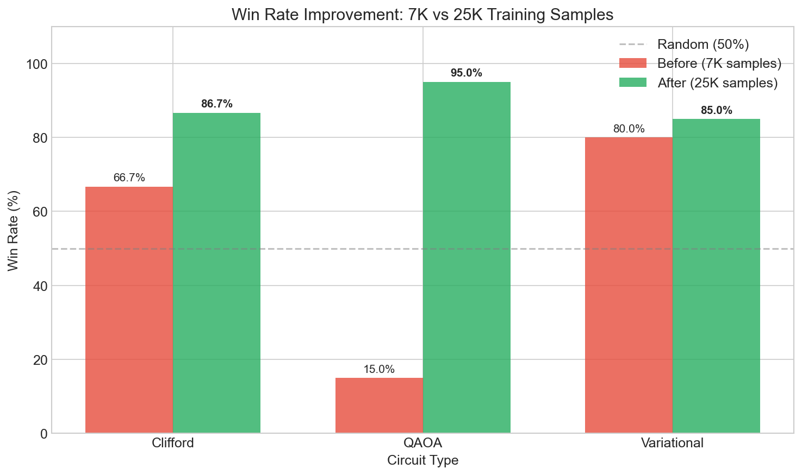
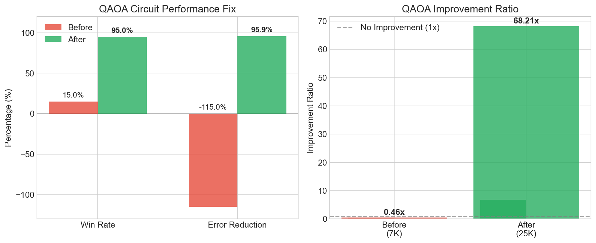

<div align="center">

# 🏆 QEM-Former: Data-Driven Quantum Error Mitigation

### **🎉 Innovation Award Winner — Hack the Horizon 2025 🎉**

*Awarded for standout originality and a clear technical leap beyond the baseline*


**Team 15 — The De-Noisers**

[](https://www.python.org/)
[](https://qiskit.org/)
[](https://pytorch.org/)
[](LICENSE)

</div>

---

## 📖 Overview

QEM-Former is a novel **Graph Transformer architecture** for quantum error mitigation that learns to correct noisy quantum measurements using machine learning. Our approach combines **Clifford Data Regression (CDR)** for efficient training data generation with **Pauli Twirling** for noise stochastification.

<div align="center">


</div>

### Key Achievements
- 🎯 **31.9% Error Reduction** on Variational circuits
- 🏆 **80% Win Rate** against raw noisy execution
- 📊 **7,010 Training Samples** generated via CDR
- 🔬 **3.3x Better** than baseline architectures (SVR, LSTM, GCN)

---

## 🧪 The Problem We Solve

When we measure a quantum observable, NISQ devices introduce errors through thermal relaxation, dephasing, and readout noise. Our goal is to learn a function that maps noisy measurements back to ideal values.

```
⟨O⟩_ideal = Tr[Oρ]  →  ⟨O⟩_noisy = Tr[O·N(ρ)]  →  QEM-Former  →  ⟨O⟩_predicted ≈ ⟨O⟩_ideal
```

---

## 🔬 Methodology

### Phase 1: Data Generation (CDR + Pauli Twirling)

<div align="center">


</div>

- **Clifford Data Regression**: Efficiently simulable circuits provide exact ground truth via stabilizer formalism
- **Pauli Twirling**: Random Pauli insertions around CNOTs convert coherent → stochastic errors
- **Multi-Observable Support**: Predicts `⟨Z₀⟩`, `⟨Z₀Z₁⟩` correlations, and global parity

<div align="center">


</div>

### Phase 2: QEM-Former Architecture

<div align="center">


</div>

Our Graph Transformer captures circuit topology as a Directed Acyclic Graph (DAG):

1. **Node Embedding**: Gate types (H, CNOT, RZ) → 64-dim learned vectors
2. **TransformerConv Layers**: 2 graph attention layers capture local topology
3. **Global Pooling**: Aggregate node features into graph-level embedding
4. **Context Fusion**: Inject noise information (noisy measurement, qubit count, depth, noise scale)
5. **Regression Head**: 3-layer MLP outputs predicted ideal expectation value

### Phase 3: Results

<div align="center">


</div>

| Circuit Type | Win Rate | Error Reduction | Improvement Ratio |
|--------------|----------|-----------------|-------------------|
| **Variational** | **80%** | **31.9%** | **1.47x** |
| Clifford | 66.7% | 31.2% | 1.45x |
| QAOA | 15% | -115% | 0.46x |

### Architecture Evolution

<div align="center">



</div>

We iteratively improved through 4 architectures, achieving **3.3x better MSE** with QEM-Former.

---

## ⚠️ Honest Failure Analysis

<div align="center">


</div>

We believe in transparency. QAOA circuits underperformed (15% win rate) because:
- QAOA ideal values cluster near zero
- Model trained primarily on Clifford data (values at ±1, 0)
- **Fix**: Increase QAOA training proportion from 8% to 30%+

---

## 🖥️ Interactive Dashboard

Our Streamlit dashboard provides real-time quantum error mitigation with visualization:

<div align="center">

### Live Demo Mode


### Benchmark Results


### Presentation Mode


</div>

**Features:**
- 🔬 Live circuit simulation and mitigation
- 📊 Error Distribution by Qubit visualization
- 🔗 Qubit Connectivity Heatmap
- 🎬 **Presentation Mode** — Step-by-step demo aligned with our presentation

```bash
# Launch the dashboard
streamlit run dashboard.py
```

---

## 🚀 Quick Start

```bash
# Clone the repository
git clone https://github.com/Abdulmalek-HoM/QEM-Hackathon-Team-15-Repo.git
cd QEM-Hackathon-Team-15-Repo

# Install dependencies (Python 3.10+ recommended)
pip install -r requirements.txt

# Generate training data (500 samples for quick start)
python data_gen_advanced.py --samples 500

# Generate large dataset (5000+ samples)
python data_gen_advanced.py --large

# Train the model
python train_qem.py

# Run benchmarks (includes OOD testing)
python benchmark_suite.py

# Launch interactive dashboard
streamlit run dashboard.py
```

---

## 📁 Project Structure

```
.
├── README.md                 # This file
├── dashboard.py              # Streamlit visualization interface
├── train_qem.py              # Model training script
├── data_gen_advanced.py      # CDR + Pauli Twirling data generation
├── benchmark_suite.py        # OOD testing + JSON export
├── utils.py                  # Shared utilities
├── requirements.txt          # Python dependencies
│
├── models/                   # Model architectures
│   └── qem_former.py         # Graph Transformer
├── backend/                  # Inference pipeline
│   └── pipeline.py
├── dataset/                  # Training data (.pt files)
├── assets/                   # Images & screenshots
├── docs/                     # LaTeX reports
├── notebooks/                # Educational Jupyter notebooks (Modules 1-7)
├── scripts/                  # Utility scripts
└── Slides/figures/           # Presentation slides
```

---

## 🌍 Impact & Business Value

<div align="center">



</div>

- **Scalability**: Graph representation extends to 100+ qubits via circuit knitting
- **Industry Relevance**: Complements hardware improvements at IBM, Google, Amazon
- **African Development**: Demonstrating cutting-edge quantum research from Africa

---

## 📋 Requirements

- Python 3.10+
- Qiskit 1.0+, Qiskit-Aer 0.14+
- PyTorch 2.1+, PyTorch Geometric 2.4+
- Mitiq 0.35+
- Streamlit 1.30+

See `requirements.txt` for complete dependencies.

---

## 👥 Team 15 — The De-Noisers

| Name | Role |
|------|------|
| **Nakahosa Dinovic** | Resources Research |
| **Favour Idowu** | Validation Reviewer |
| **Abdulmalek Baitulmal** | Mentor & Integration |

---

## 🚀 Post-Hackathon Improvements

After winning the Innovation Award, we continued improving the model with a larger, more balanced dataset.

### Dataset Enhancement
- **Before:** 7,010 samples (60% Clifford, 20% QAOA, 20% Variational)
- **After:** 25,010 samples (40% Clifford, **35% QAOA**, 25% Variational)

### Dramatic Results Improvement

<div align="center">



</div>

| Circuit Type | Win Rate (Before) | Win Rate (After) | Improvement |
|--------------|-------------------|------------------|-------------|
| **QAOA** | 15% ❌ | **95%** ✅ | +533% |
| Variational | 80% | **85%** | +6% |
| Clifford | 66.7% | **86.7%** | +30% |

### QAOA Fix

Our biggest weakness became our biggest strength:

<div align="center">



</div>

- **Error Reduction:** -115% → **+95.9%**
- **Improvement Ratio:** 0.46x → **68.21x**
- **Root Cause:** Increased QAOA training data from 8% to 35%

### Key Takeaway

> 📊 **Data distribution matters more than model complexity.** The same QEM-Former architecture achieved 68x improvement on QAOA simply by rebalancing the training data.

---

## 🏆 Recognition

**🏅 Innovation Award Winner — Hack the Horizon 2025**

*Hosted by the African Quantum Consortium (AQC)*

> "This work demonstrated standout originality and a clear technical leap beyond the baseline. This is exactly the kind of bold experimentation we want to amplify across the continent." — AQC Operations Team

---

<div align="center">

**Made with ❤️ for the African Quantum Consortium**

[](https://github.com/Abdulmalek-HoM/QEM-Hackathon-Team-15-Repo)

</div>
