<div align="center">

# 🏆 CDRFormer: Data-Driven Quantum Error Mitigation

### **🎉 Innovation Award Winner — Hack the Horizon 2025 🎉**

*Awarded for standout originality and a clear technical leap beyond the baseline*

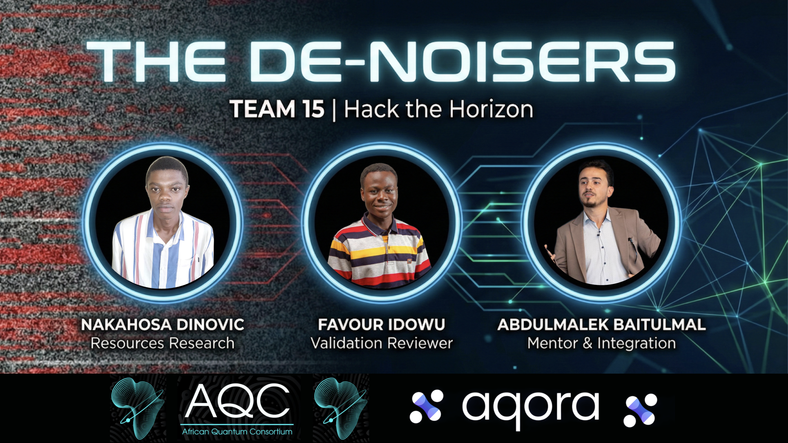

**Team 15 — The De-Noisers**

[](https://www.python.org/)
[](https://qiskit.org/)
[](https://pytorch.org/)
[](LICENSE)

</div>

---

## 📖 Overview

CDRFormer is a novel **Graph Transformer architecture** for quantum error mitigation that learns to correct noisy quantum measurements using machine learning. Our approach combines **Clifford Data Regression (CDR)** for efficient training data generation with **Pauli Twirling** for noise stochastification.

<div align="center">

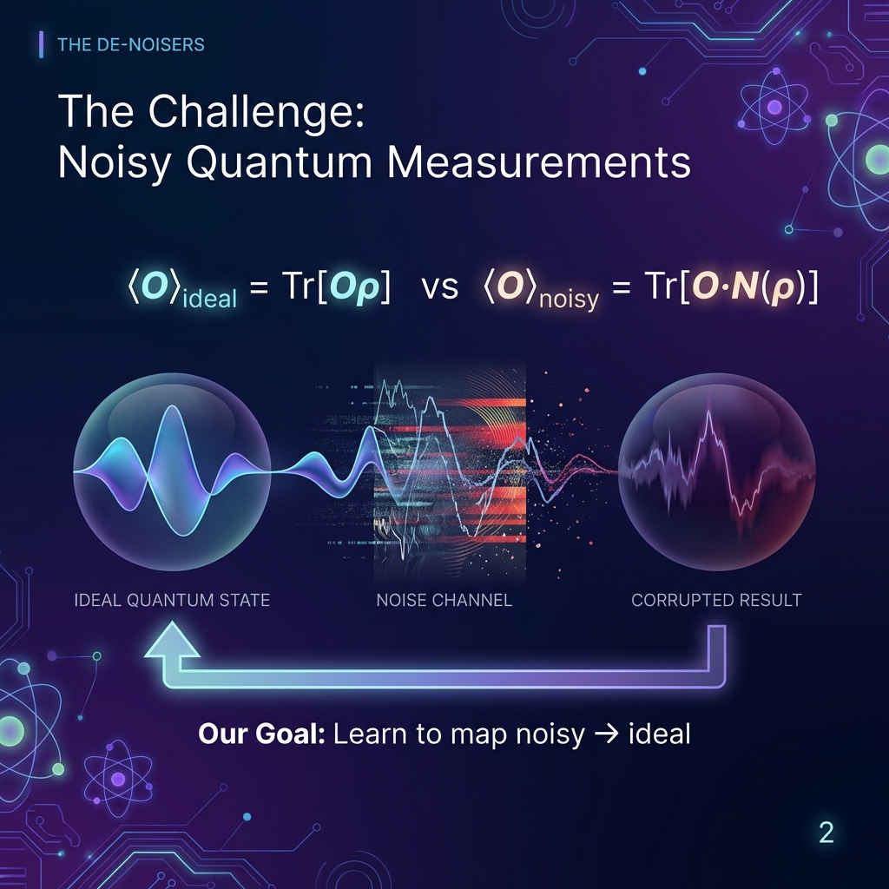

</div>

### Key Achievements
- 🎯 **98% QAOA Win Rate** — up from 15% via data composition optimization
- 🏆 **90-100% Win Rate** across all noise profiles (incl. IBM FakeHanoi/FakeCairo)
- 📊 **25,010 Training Samples** generated via CDR + Pauli Twirling
- 🔬 **Scales to 18 qubits** (3.6× beyond training range) with <2ms inference
- 🧪 **+20pp improvement** from Pauli Twirling (noise Markovianization)
- 📈 **Data composition > architecture** — our key discovery

---

## 📚 Relationship to Prior Work

> **Note:** CDRFormer is named to distinguish from [**QEMFormer**](https://icml.cc/virtual/2025/poster/45382) (Bao et al., ICML 2025), which focuses on dual-branch architecture design. Our contribution is **complementary**: efficient training data generation via CDR + Pauli Twirling.

| Aspect | QEMFormer [Bao et al.] | CDRFormer (Ours) |
|--------|------------------------|------------------|
| **Focus** | Architecture design | Data generation |
| **Key Innovation** | Dual-branch multi-scale encoder | CDR + Pauli Twirling pipeline |
| **Training Data** | Assumes QEM-Bench datasets | Generates via classical simulation |
| **Hardware Required** | Quantum hardware for data | **None** (classical only) |

---

## 🧪 The Problem We Solve

When we measure a quantum observable, NISQ devices introduce errors through thermal relaxation, dephasing, and readout noise. Our goal is to learn a function that maps noisy measurements back to ideal values.

```
⟨O⟩_ideal = Tr[Oρ]  →  ⟨O⟩_noisy = Tr[O·N(ρ)]  →  CDRFormer  →  ⟨O⟩_predicted ≈ ⟨O⟩_ideal
```

---

## 🔬 Methodology

### Phase 1: Data Generation (CDR + Pauli Twirling)

<div align="center">

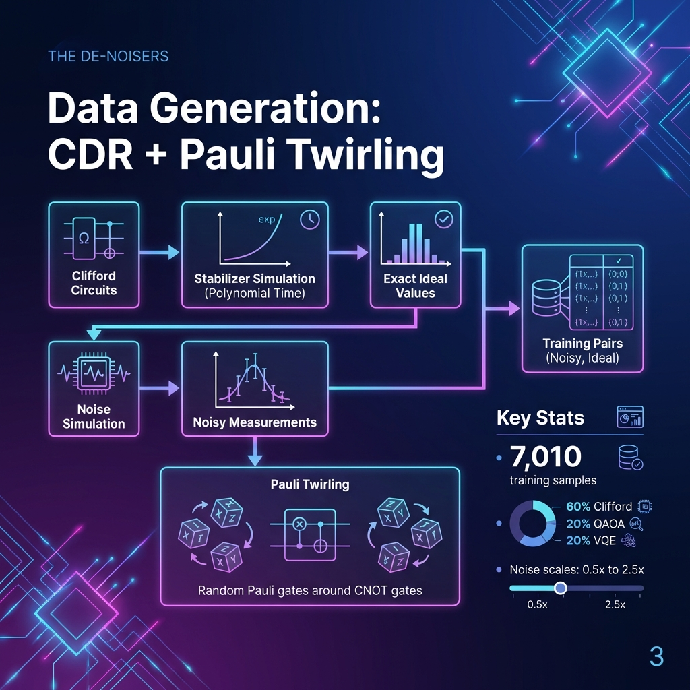

</div>

- **Clifford Data Regression**: Efficiently simulable circuits provide exact ground truth via stabilizer formalism
- **Pauli Twirling**: Random Pauli insertions around CNOTs convert coherent → stochastic errors
- **Multi-Observable Support**: Predicts `⟨Z₀⟩`, `⟨Z₀Z₁⟩` correlations, and global parity

<div align="center">

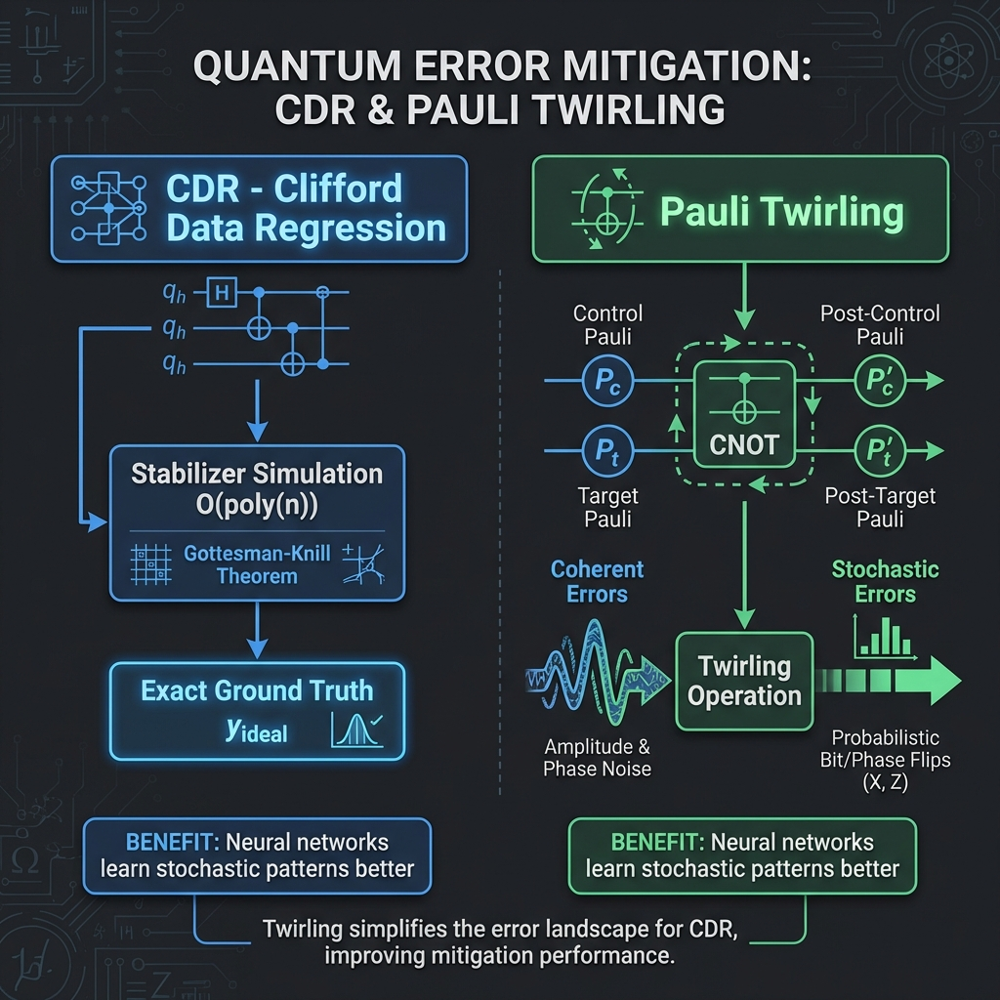

</div>

### Phase 2: CDRFormer Architecture

<div align="center">

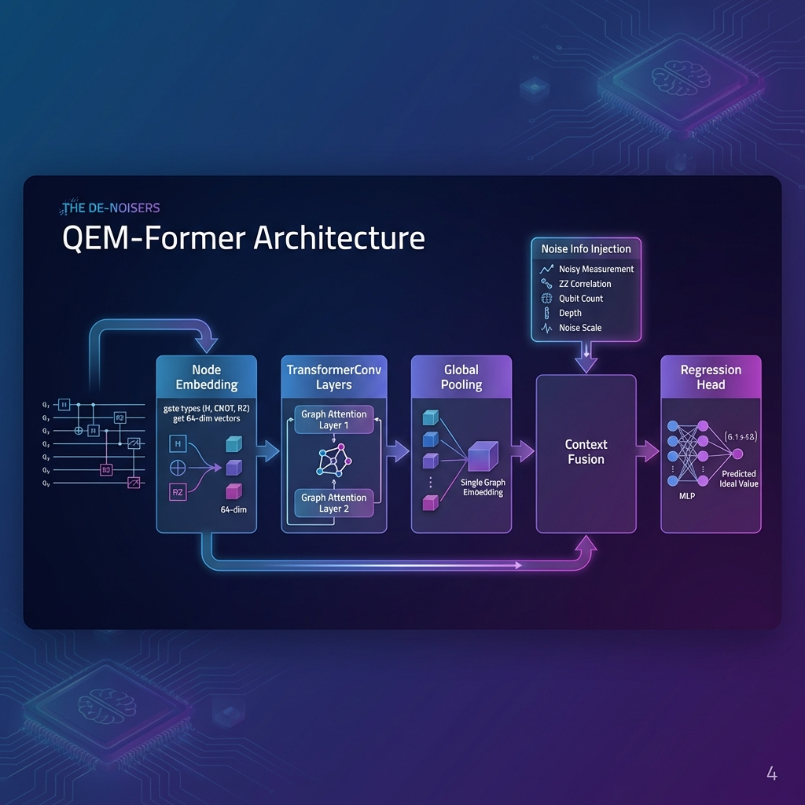

</div>

Our Graph Transformer captures circuit topology as a Directed Acyclic Graph (DAG):

1. **Node Embedding**: Gate types (H, CNOT, RZ) → 64-dim learned vectors
2. **TransformerConv Layers**: 2 graph attention layers capture local topology
3. **Global Pooling**: Aggregate node features into graph-level embedding
4. **Context Fusion**: Inject noise information (noisy measurement, qubit count, depth, noise scale)
5. **Regression Head**: 3-layer MLP outputs predicted ideal expectation value

### Phase 3: Results

#### Baseline Comparison (5-seed average)

| Method | QAOA Win Rate | Variational Win Rate |
|--------|:-------------:|:--------------------:|
| Noisy (baseline) | 0% | 0% |
| ZNE (Linear) | 51.0% | 60.5% |
| ZNE (Richardson) | 21.0% | 40.0% |
| CDR (Linear Reg.) | 38.0% | 50.0% |
| **CDRFormer (Ours)** | **98.0%** | **90.0%** |

#### Noise Profile Generalization

| Noise Type | Win Rate |
|------------|:--------:|
| Incoherent (Depolarizing) | 93.3% |
| Coherent (Over-rotation) | 93.3% |
| Combined (Incoh+Coh) | 90.0% |
| FakeHanoi (27Q IBM) | **100.0%** |
| FakeCairo (27Q IBM) | 96.7% |

#### Scalability (Trained on 5Q → Tested up to 18Q)

| Qubits | Win Rate | Inference |
|:------:|:--------:|:---------:|
| 5 | 90% | 2.0ms |
| 8 | 95% | 0.7ms |
| 10 | 90% | 0.7ms |
| 12 | 95% | 0.9ms |
| 15 | 95% | 1.1ms |
| 18 | 80% | 1.7ms |

---

## 🔬 Key Discovery: Data Composition > Architecture

Our most important finding: **training data composition matters more than architecture complexity.**

| QAOA Training % | QAOA Win Rate |
|:---------------:|:-------------:|
| 8% (original) | 93.3% |
| 20% | **100%** |
| 35% | **100%** |
| 50% | **100%** |

> The same CDRFormer architecture achieves perfect QAOA win rate simply by ensuring ≥20% QAOA in training data.

### Pauli Twirling Ablation

| Condition | QAOA Win Rate |
|-----------|:-------------:|
| WITHOUT Twirling | 80.0% |
| WITH Twirling | **100.0%** |

> Pauli Twirling provides **+20 percentage points** improvement by converting coherent noise to stochastic (Markovian) noise.

---

## 🖥️ Interactive Dashboard

Our Streamlit dashboard provides real-time quantum error mitigation with visualization:

<div align="center">

### Live Demo Mode
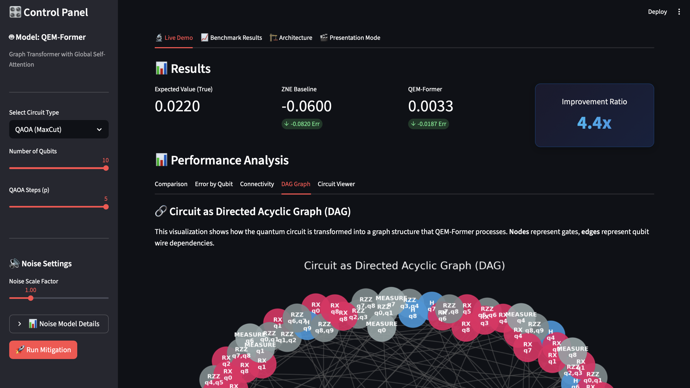

### Benchmark Results
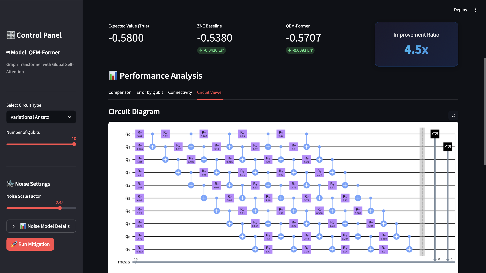

### Presentation Mode
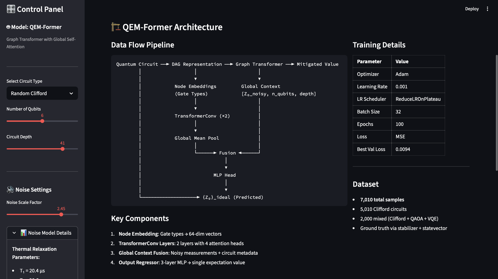

</div>

**Features:**
- 🔬 Live circuit simulation and mitigation
- 📊 Error Distribution by Qubit visualization
- 🔗 Qubit Connectivity Heatmap
- 🎬 **Presentation Mode** — Step-by-step demo aligned with our presentation

```bash
# Launch the dashboard
streamlit run dashboard.py
```

---

## 🚀 Quick Start

```bash
# Clone the repository
git clone https://github.com/Abdulmalek-HoM/QEM-Hackathon-Team-15-Repo.git
cd QEM-Hackathon-Team-15-Repo

# Install dependencies (Python 3.10+ recommended)
pip install -r requirements.txt

# Generate training data (500 samples for quick start)
python data_gen_advanced.py --samples 500

# Generate large dataset (5000+ samples)
python data_gen_advanced.py --large

# Train the model
python train_qem.py

# Run benchmarks (includes OOD testing)
python benchmark_suite.py

# Launch interactive dashboard
streamlit run dashboard.py
```

---

## 📁 Project Structure

```
.
├── README.md                 # This file
├── dashboard.py              # Streamlit visualization interface
├── train_qem.py              # Model training script
├── data_gen_advanced.py      # CDR + Pauli Twirling data generation
├── benchmark_suite.py        # OOD testing + JSON export
├── utils.py                  # Shared utilities
├── requirements.txt          # Python dependencies
│
├── models/                   # Model architectures
│   └── cdr_former.py         # Graph Transformer
├── backend/                  # Inference pipeline
│   └── pipeline.py
├── dataset/                  # Training data (.pt files)
├── weights/                  # Trained model weights
│   ├── cdr_former.pth        # Main model (with twirling)
│   └── cdr_former_no_twirling.pth  # Ablation model
├── assets/                   # Images, figures & benchmark results
│   ├── fig_data_composition.png    # Publication figure
│   ├── fig_scalability.png         # Publication figure
│   ├── fig_noise_profiles.png      # Publication figure
│   └── fig_baseline_comparison.png # Publication figure
├── docs/                     # LaTeX reports
├── notebooks/                # Educational Jupyter notebooks (Modules 1-7)
├── scripts/                  # Experiment scripts
│   ├── data_composition_ablation.py  # Data ratio experiment
│   ├── scalability_benchmark.py      # 5-18 qubit scaling
│   ├── noise_profile_benchmark.py    # QEM-Bench noise testing
│   ├── twirling_ablation.py          # Pauli Twirling ablation
│   └── generate_publication_figures.py
└── Slides/figures/           # Presentation slides
```

---

## 🌍 Impact & Business Value

<div align="center">

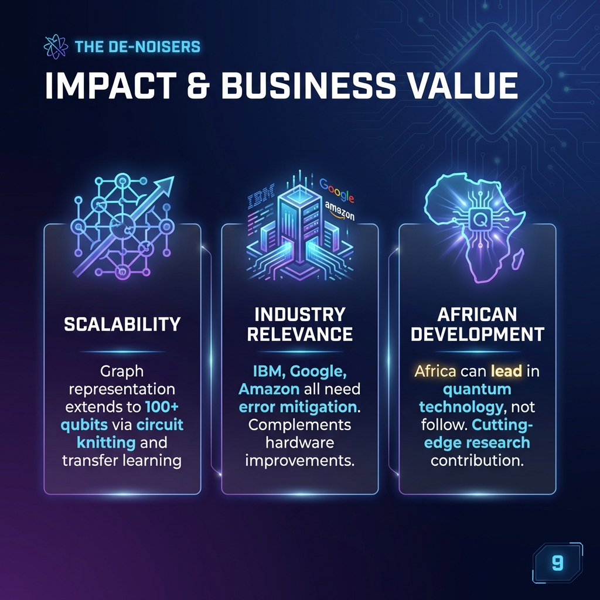

</div>

- **Scalability**: Graph representation extends to 100+ qubits via circuit knitting
- **Industry Relevance**: Complements hardware improvements at IBM, Google, Amazon
- **African Development**: Demonstrating cutting-edge quantum research from Africa

---

## 📋 Requirements

- Python 3.10+
- Qiskit 1.0+, Qiskit-Aer 0.14+
- PyTorch 2.1+, PyTorch Geometric 2.4+
- Mitiq 0.35+
- Streamlit 1.30+

See `requirements.txt` for complete dependencies.

---

## 👥 Team 15 — The De-Noisers

| Name | Role |
|------|------|
| **Nakahosa Dinovic** | Resources Research |
| **Favour Idowu** | Validation Reviewer |
| **Abdulmalek Baitulmal** | Mentor & Integration |

---

## 🚀 Post-Hackathon Research

After winning the Innovation Award, we conducted comprehensive ablation studies toward an **IEEE QCE 2026** publication.

### Key Thesis

> **"QEMFormer shows WHAT architecture to use. CDRFormer shows HOW to generate training data without quantum hardware."**

### Completed Experiments

| Experiment | Key Finding |
|------------|-------------|
| **Data Composition** | ≥20% QAOA in training → 100% win rate |
| **Baseline Comparison** | 98% QAOA win rate (vs 51% ZNE, 38% CDR) |
| **Noise Profiles** | 90-100% across 5 noise types (incl. IBM FakeBackends) |
| **Scalability** | 80-95% from 5 to 18 qubits, <2ms inference |
| **Pauli Twirling** | +20pp improvement from noise Markovianization |

### Publication Figures

<div align="center">

| | |
|:--:|:--:|
| 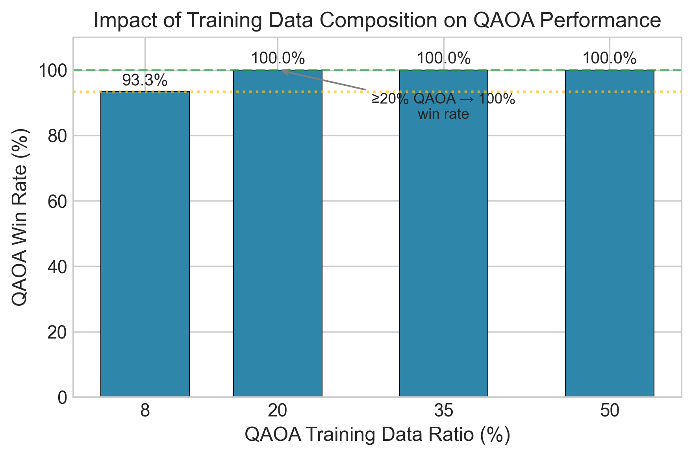 | 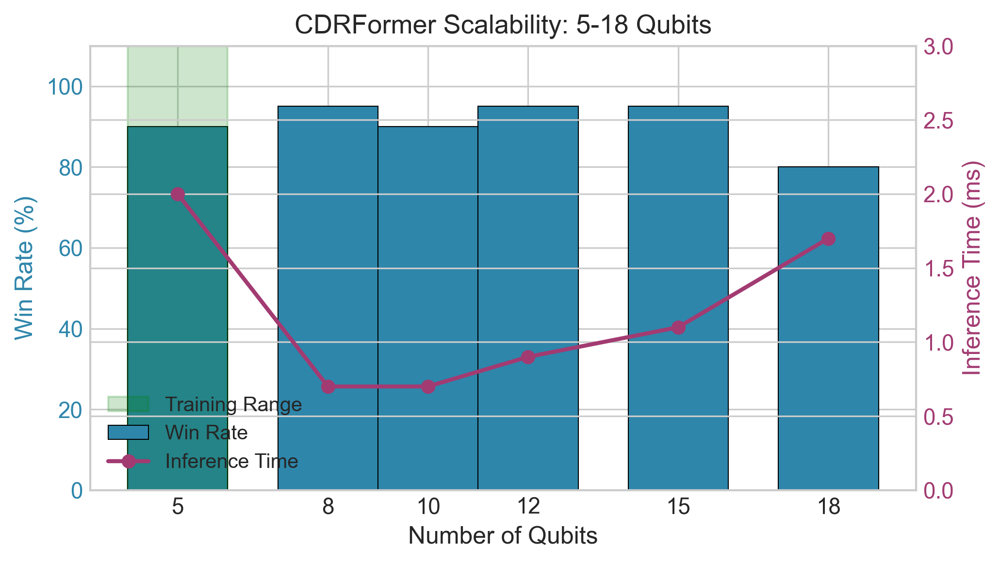 |
| 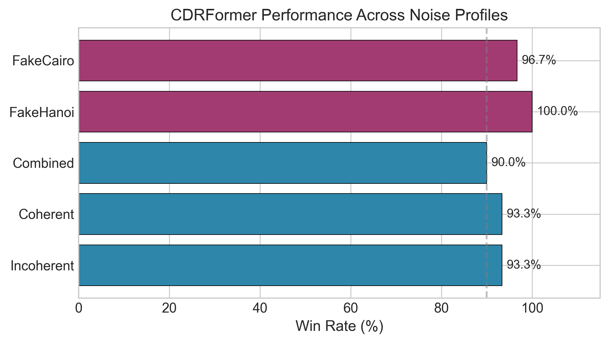 | 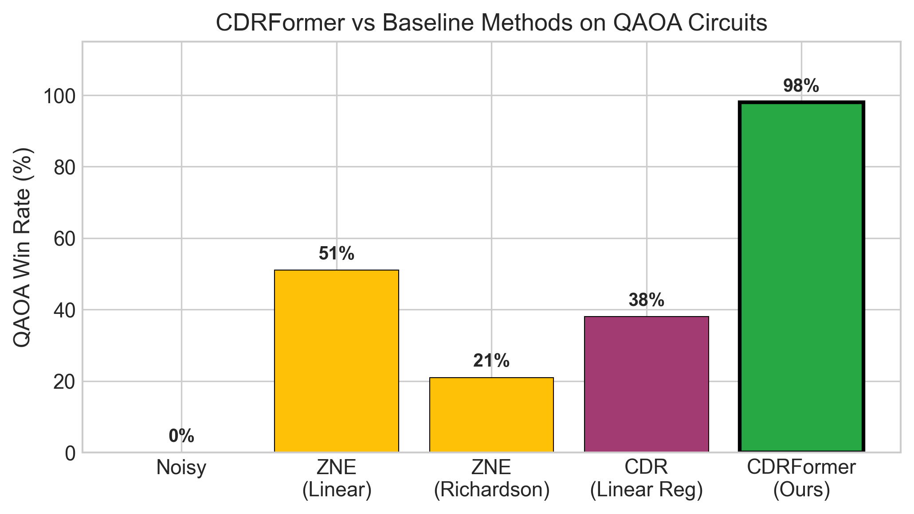 |

</div>

---

## 🏆 Recognition

**🏅 Innovation Award Winner — Hack the Horizon 2025**

*Hosted by the African Quantum Consortium (AQC)*

> "This work demonstrated standout originality and a clear technical leap beyond the baseline. This is exactly the kind of bold experimentation we want to amplify across the continent." — AQC Operations Team

---

<div align="center">

**Made with ❤️ for the African Quantum Consortium**

[](https://github.com/Abdulmalek-HoM/QEM-Hackathon-Team-15-Repo)

</div>
